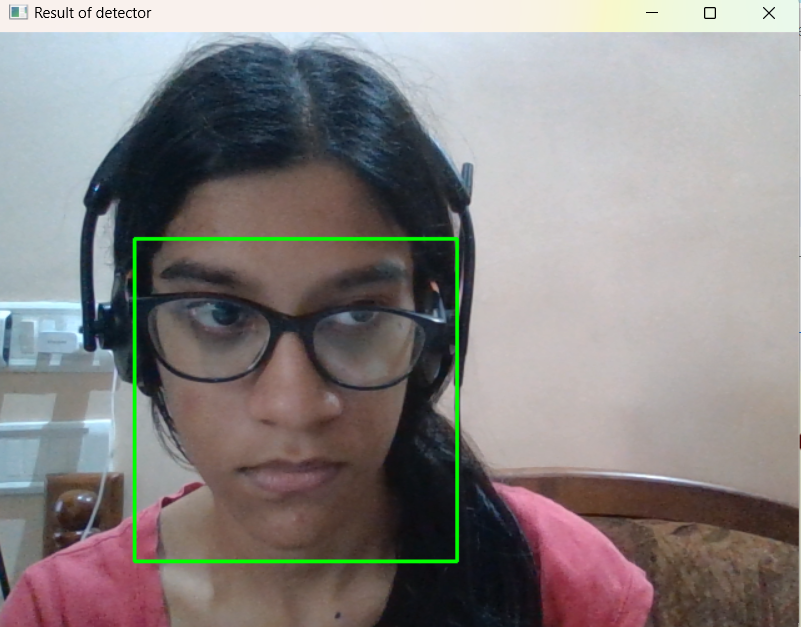
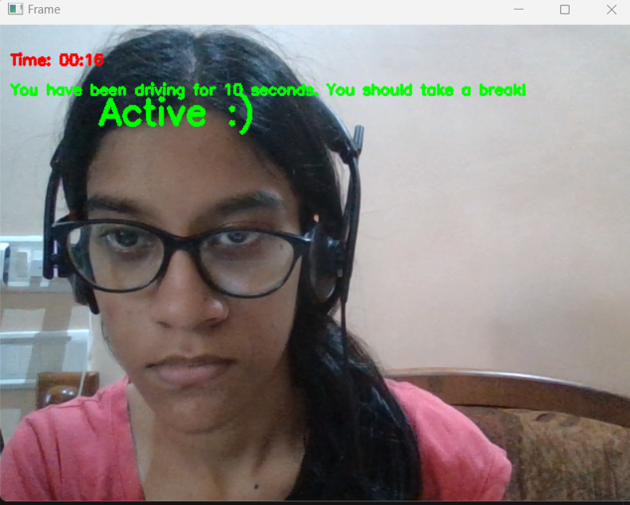
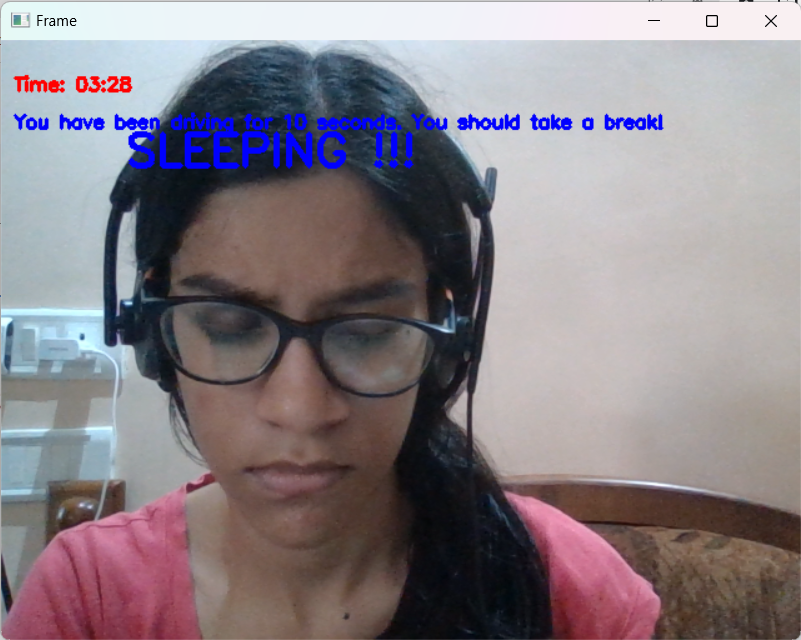
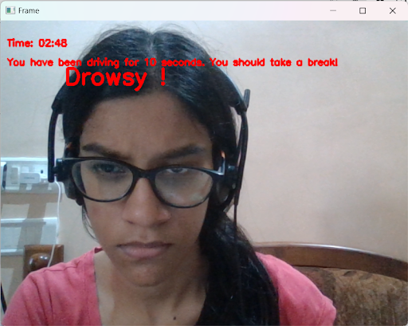

# Driver-Drowsiness-Detection
Driver drowsiness detection is a project built using Dlib and OpenCV with Python as a backend language.

---

<h3>Logic of project</h3>
The project includes direct working with the 68 facial landmark detector and also the face detector of the Dlib library.
The 68 facial landmark detector is a robustly trained efficient detector which detects the points on the human face using which 
we determine whether the eyes are open or they are closed.  

  

# Important files to download
Please download these files before running the project:

<b>Python version required: 3.10.</b><b> <a href="https://www.python.org/downloads/release/python-3100/">It can be found here</a></b>.

<b>The 68-landmark detector data (.dat) file can be found <a href="https://github.com/davisking/dlib-models">by clicking here</a></b>.

---

<h3>The working of the project</h3>
<ul><li>As you can see the<b> above screenshot</b> where the landmarks aredetected using the detector.
<li>Now we are taking the ratio which is described as <i>'Sum of distances of vertical landmarks divided by twice the distance between horizontal landmarks'</i>.
<li>Now this ratio is totally dependent on your system which you may configure accordingly for the thresholds of sleeping, drowsy, active.</ul>

  
    
  
    
  

---

# How to Download the Project?
1) Click on the Code option.
2) Then Select 'Download Zip'.
3) Extract the folder.
4) Please run the main.py file in Visual Studio Code. (It works)

---

## 👩‍💻 Contributors/Collaborators  
- [Saileen Fernandes (@Sai25Hajime)](https://github.com/Sai25Hajime)
- [Jelestina Nadar (@Jelestina)](https://github.com/Jelestina)
- [Alister Almeida (@miali4657)](https://github.com/miali4657)

